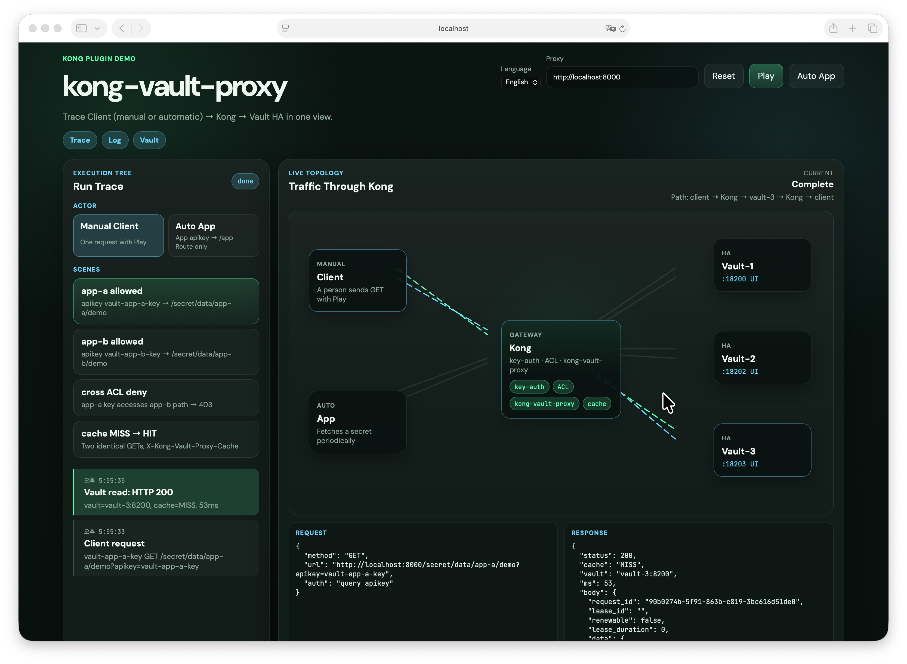

# Demo (local e2e)

Validates `kong-vault-proxy` AppRole authentication, token renewal, and failover with a three-node Vault Raft cluster and Kong Enterprise (`kong-net`).

## Prerequisites

- Running `kong-enterprise/docker` (`kong-net`, Admin `:8001`, Proxy `:8000`)
- `deck`, `jq`, `docker`

## Run

```bash
./up.sh
```

Initializes and unseals Vault, configures AppRole (one-shot Secret ID → orphan periodic token), mounts the Kong plugin, syncs decK, and runs the tests.

## Flow UI

```bash
./ui/serve.sh
# http://127.0.0.1:3090
```



Provides app-a, app-b, cross-ACL denial, cache MISS→HIT, and Auto App scenarios.

## Checks

1. Client/App isolation using `key-auth`, Routes, and ACLs
2. AppRole Secret ID reuse rejection
3. Consecutive periodic token (`period=30s`) renewals at the 4/5 point
4. Proxy availability during Vault leader failure and recovery

Vault UI: vault-1 `18200`, vault-2 `18202`, vault-3 `18203`

## Clean up

```bash
./clean.sh
```

[한국어](README_KO.md)
